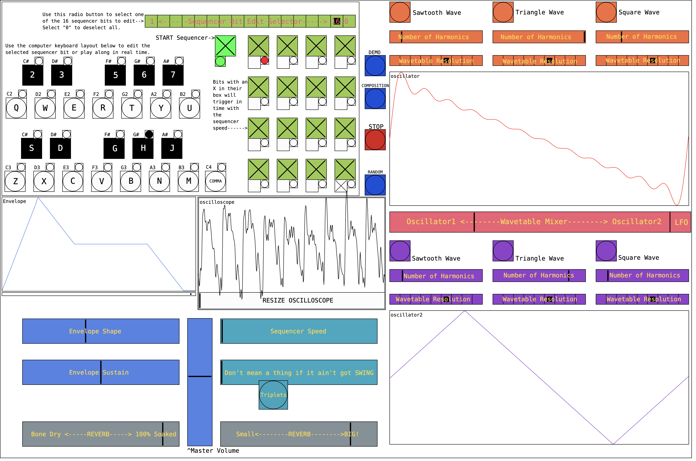

# 16BitWavetableSequencer
A 16 bit sequencer synthesiser, coded in Purr data, with two mixable, highly customisable, wavetable synthesiers, reverb, a visual ADSR filter, and an audio visual demonstration using the GEM audio visual framework. 

[Please see this short report for more details on the design process, the audio visual demonstration, and an evaluation of the prototype.](Synthesis%20and%20Psychoacoustics%20Report%20Aidan%20Bennett.pdf)

